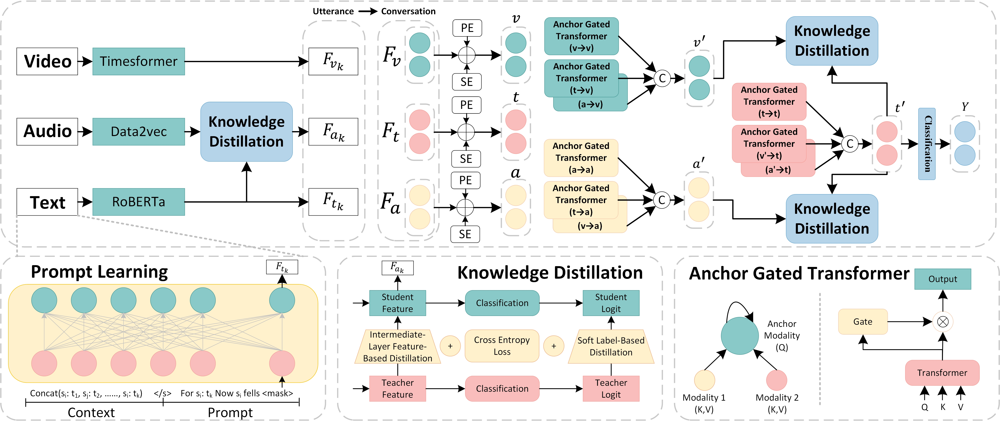

# MAGTKD
Jie Li, Shifei Ding, Lili Guo, and Xuan Li, "Multi-modal Anchor Gated Transformer with Knowledge Distillation for Emotion Recognition in Conversation". (IJCAI 2025, Pytorch Code)

## Abstract
Emotion Recognition in Conversation (ERC) aims to detect the emotions of individual utterances within a conversation. Generating efficient and modality-specific representations for each utterance remains a significant challenge. Previous studies have proposed various models to integrate features extracted using different modality-specific encoders. However, they neglect the varying contributions of modalities to this task and introduce high complexity by aligning modalities at the frame level. To address these challenges, we propose the Multi-modal Anchor Gated Transformer with Knowledge Distillation (MAGTKD) for the ERC task. Specifically, prompt learning is employed to enhance textual modality representations, while knowledge distillation is utilized to strengthen representations of weaker modalities. Furthermore, we introduce a multi-modal anchor gated transformer to effectively integrate utterance-level representations across modalities. Extensive experiments on the IEMOCAP and MELD datasets demonstrate the effectiveness of knowledge distillation in enhancing modality representations and achieve state-of-the-art performance in emotion recognition. Our code is available at: https://github.com/JieLi-dd/MAGTKD.

<picture>

</picture>

## Requirements
The following pretrained models are used for feature extraction from the three modalities:
1. Text Modality: [RoBERTa-large](https://huggingface.co/FacebookAI/roberta-large)
2. Audio Modality: [data2vec-audio-base-960h](https://huggingface.co/facebook/data2vec-audio-base-960h)
3. Video Modality: [Videomae-base and](https://huggingface.co/MCG-NJU/videomae-base) and 
[Timesformer-base-finetuned-k400](https://huggingface.co/facebook/timesformer-base-finetuned-k400)

Python environment dependencies:
```
python==3.9.19
torch==1.13.1+cu116
torchvision==0.14.1+cu116   
torchaudio==0.13.1+cu116
transformers==4.27.2
```

## Clone

本仓库部分大文件通过 Git LFS 托管，克隆前请先安装 [Git LFS](https://git-lfs.github.com/)：

```bash
git lfs install
git clone https://github.com/debugmax/Emotion_Calculation.git
cd Emotion_Calculation
```

## Download Missing Model Weights

受 GitHub 单文件大小限制，`MELD/MELD/save_model/` 中部分一阶段模型权重未包含在仓库内。请从 ModelScope 下载后解压，并**合并**到该目录。

**下载地址**：[ModelScope - max2003/magtkd](https://www.modelscope.cn/models/max2003/magtkd/files)

**目标目录**：`MELD/MELD/save_model/`

**仓库中已包含**（无需重复下载）：

| 文件 | 说明 |
|------|------|
| `multimodal_fusion_best.bin` | 最优融合模型（Git LFS） |
| `checkpoint_config.json` | 最优训练/推理配置 |
| `multimodal_fusion_best.json` | 测试集预测结果（用于校验） |

**需从 ModelScope 下载并合并**：

| 文件 | 说明 |
|------|------|
| `text.bin` | 文本模态一阶段模型 |
| `audio.bin` | 音频模态一阶段模型 |
| `video.bin` | 视频模态一阶段模型 |
| `text_KD_audio.bin` | 文本→音频知识蒸馏模型 |
| `text_KD_video.bin` | 文本→视频知识蒸馏模型 |
| `fusion_head_best.bin` | 融合头权重（非 fixed 模式时使用，可选） |

**操作步骤**：

1. 打开 [ModelScope 模型文件页](https://www.modelscope.cn/models/max2003/magtkd/files)，下载压缩包或对应 `.bin` 文件；
2. 解压下载内容；
3. 将上述缺失文件复制到 `MELD/MELD/save_model/`，与仓库已有文件合并（**不要覆盖** `multimodal_fusion_best.bin`、`checkpoint_config.json`、`multimodal_fusion_best.json`）。

合并完成后，目录结构如下：

```
MELD/MELD/save_model/
├── text.bin                      # ModelScope 下载
├── audio.bin                     # ModelScope 下载
├── video.bin                     # ModelScope 下载
├── text_KD_audio.bin             # ModelScope 下载
├── text_KD_video.bin             # ModelScope 下载
├── fusion_head_best.bin          # ModelScope 下载（可选）
├── multimodal_fusion_best.bin    # 仓库已提供
├── checkpoint_config.json        # 仓库已提供
└── multimodal_fusion_best.json   # 仓库已提供
```

> **预训练模型**：`pretrained_model/` 目录（RoBERTa-large、data2vec、Timesformer 等）未上传至 GitHub，请按上方 Requirements 中的链接自行下载，放置到项目根目录 `pretrained_model/` 下。

## MELD Inference (Optimized)

本仓库包含 MELD 多模态融合优化代码。仅复现最优推理结果时，需确保已具备：

- `MELD/feature/first_stage_test_features.pkl`（仓库已包含）
- `MELD/MELD/save_model/multimodal_fusion_best.bin`（仓库已包含）

```bash
cd MELD
python inference.py \
  --checkpoint ./MELD/save_model/multimodal_fusion_best.bin \
  --config ./MELD/save_model/checkpoint_config.json \
  --split test
```

预期输出：`accuracy=67.05, f1=65.52`。详细实验说明见 [`MELD/EXPERIMENT_REPORT.md`](MELD/EXPERIMENT_REPORT.md)。


## Train and test
To train from scratch on the MELD dataset:
```
# 1. Extract text features
python text.py  

# 2. Extract audio features
python audio.py  

# 3. Extract raw video features
python video_feature_extract.py  

# 4. Process video features
python video.py  

# 5. Perform knowledge distillation (audio student, text teacher)
python KD.py --student audio --teacher text  

# 6. Perform knowledge distillation (video student, text teacher)
python KD.py --student video --teacher text  

# 7. Extract fused features from all modalities (first stage)
python extract_first_stage_features.py  

# 8. Perform multimodal fusion training and testing
python multimodel_fusion.py
```

